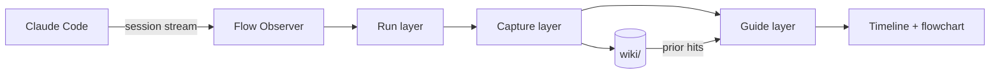

<p align="right">
  <strong>English</strong> · <a href="README_CN.md">简体中文</a>
</p>

<p align="center">
  
</p>

<h1 align="center">GUI-Anything</h1>

<p align="center">
  <strong>The flight recorder for long Claude Code sessions.</strong>
</p>

<p align="center">
  Claude keeps coding in the left pane. GUI-Anything watches from the right,
  turns long sessions into a live map, and brings useful context back when you need it.
</p>

<p align="center">
  <a href="#quick-start"><b>Quick Start</b></a> ·
  <a href="#sidecar-view"><b>Sidecar View</b></a> ·
  <a href="#memory-layer"><b>Memory Layer</b></a> ·
  <a href="#how-it-works"><b>Architecture</b></a> ·
  <a href="#contributing"><b>Contributing</b></a>
</p>

<p align="center">
  <a href="package.json"></a>
  
  
  
</p>

<br>

> Vibe coding is fast until the trail disappears. GUI-Anything adds the missing sidecar: live timeline, intent graph, project memory, and replay you can trust, without wrapping or driving Claude Code.

<div align="center">
<table>
<tr>
<td align="center" width="33%">

### Run

Claude Code stays native in the left pane. The observer shows explorations, tools, phases, and errors in real time.

</td>
<td align="center" width="33%">

### Capture

The right pane turns long scrollback into summaries, flowchart hints, and intent-aware context.

</td>
<td align="center" width="33%">

### Guide

Relevant project memory appears inline while the current exploration is still running. Resume keeps the story intact.

</td>
</tr>
</table>
</div>

## Quick Start

**Requirements:** [Claude Code CLI](https://docs.anthropic.com/en/docs/claude-code) · [Bun](https://bun.sh) · [Zellij](https://zellij.dev)

Install from source:

```bash
git clone https://github.com/YurunChen/GUI-Anything.git
cd GUI-Anything
./scripts/setup.sh
ga doctor
ga flow
```

Everyday commands:

```bash
ga doctor
ga flow
ga flow --continue
ga flow --resume <session-id>
ga flow --model sonnet "your task"
./scripts/flow-run.sh --cleanup
```

## Sidecar View

GUI-Anything is a sidecar. Claude Code stays native, while the observer renders the session as timeline, flowchart, summaries, and project memory.

| Left pane | Right pane |
|-----------|------------|
| Claude Code runs unchanged | Flow Observer watches the session in real time |
| You keep the normal terminal workflow | Timeline, phase badges, tools, errors, and summaries stay visible |
| No wrapper controls the agent | Useful context is saved locally for later |
| Your session can stay messy | The map stays readable after the conversation gets long |

Focus the **right pane** first, then use:

| Key | Action |
|-----|--------|
| `g` | Timeline / flowchart |
| `i` | Notes sidebar |
| `?` / `/` / `Ctrl-K` | Help |
| `c` | Calm mode |
| `[` `]` | Previous / next theme |
| `k` | Flag a wrong wiki match |
| `h` | Export and open project evolution HTML |
| `q` | Quit observer |

Chinese UI: `FLOW_LOCALE=zh-Hans`.

## Memory Layer

Most coding agents can generate. Fewer tools help you remember what just happened. GUI-Anything keeps three linked views of the same work:

| Layer | What it captures | What you get back |
|-------|------------------|-------------------|
| **Run** | Explorations, tool calls, errors, phases | A live session timeline instead of raw scrollback |
| **Capture** | Summaries, flowchart hints, intent buckets | The shape of the work, not just the transcript |
| **Guide** | Prior wiki matches and focused trails | Context from past sessions while the current turn is still running |

Project memory stays local by default. Related turns accumulate by intent; curation happens on pivot or idle sweep, not every exploration.

## What Makes It Different

| Capability | Design choice |
|------------|---------------|
| **Native dual-pane Claude** | The left side is still Claude Code. GUI-Anything observes instead of taking over. |
| **Live flowchart** | Exploration turns become a readable intent graph with responsive terminal layouts. |
| **Inline KNOWLEDGE hits** | Prior local wiki entries surface while the current exploration is still running. |
| **Intent-aware curation** | Same-task turns compound into a bucket; pivot or idle sweep writes durable context. |
| **Honest resume** | `--resume` replays saved session data. It does not silently rebuild the story. |
| **Continue without drift** | `--continue` keeps existing context and summarizes only new explorations. |
| **33 terminal themes** | Hot-swap with `[` and `]`; Spectra is the kinetic showcase. |
| **Shareable HTML** | Export a project evolution page, single-session drill-down, or knowledge graph. |
| **Web Mirror** | Watch progress from a browser when the terminal is not the best display. |
| **WeChat notifications** | Walk away and still catch errors or milestones. |

## Demo Gallery

Recommended real recordings for the README:

| File | Length | Story |
|------|--------|-------|
| `assets/demo/hero.mp4` / `hero.gif` | 12-18s | Start `ga flow`, then watch timeline and flowchart update |
| `assets/demo/knowledge.gif` | 8-12s | A prior wiki hit appears inline, then `k` audits a bad match |
| `assets/demo/resume.gif` | 8-12s | `ga flow --resume <id>` replays without re-summary |

## How It Works

```text
Run      Session stream -> explorations, tools, errors, phases
Capture  AI summaries, flowchart hints, intent buckets, wiki curation
Guide    prior wiki matches, flowchart, notes, hotkeys
```



More detail: [data flow](docs/data-governance/data-flow.md) · [development guide](docs/development.md) · [agent rules](AGENTS.md)

## Optional Superpowers

<details>
<summary><b>HTML export</b> - project evolution, mirror, knowledge graph</summary>

```bash
# Project evolution, defaulting to all sessions in this workspace.
ga export -o evolution.html

# In ga flow, press h to export and open the project evolution page.

# Single-session drill-down.
ga export --scope session --session-id <id> -o evo.html

# Skip AI era synthesis, using deterministic rule grouping.
ga export --no-ai --theme catppuccin -o evo.html

# Real-time browser view.
cd scheme
FLOW_PROJECT_DIR=/path/to/repo FLOW_SESSION_ID=<uuid> \
  bun run src/main.ts --web-mirror --port 3001

# Force-directed graph from local wiki.
bun run src/main.ts --knowledge-graph -o graph.html
```

See [docs/IDEAS_HTML_INTEGRATION.md](docs/IDEAS_HTML_INTEGRATION.md).
</details>

<details>
<summary><b>Notifications</b> - WeChat</summary>

```bash
ga notify setup
ga flow
```

See [docs/NOTIFICATION.md](docs/NOTIFICATION.md) and [docs/NOTIFICATION_WECHAT.md](docs/NOTIFICATION_WECHAT.md).
</details>

<details>
<summary><b>llm-wiki</b> - agentic knowledge ingest</summary>

Wiki curation uses the `/llm-wiki` skill in [skills/llm-wiki](skills/llm-wiki/).

```bash
./scripts/setup.sh
./scripts/wiki/wiki-maintain.sh
```

See [scripts/wiki/README.md](scripts/wiki/README.md).
</details>

## Project Status

GUI-Anything is early but usable. The core Claude Code sidecar path is the supported path today.

| Area | Status |
|------|--------|
| `ga flow` dual-pane launcher | Supported |
| Claude Code session observer | Supported |
| Local wiki retrieval and curation | Supported |
| Strict resume / continue replay | Supported |
| HTML export / Web Mirror | Experimental |
| Other agent backends | Not yet supported |

## Roadmap

- Record real `ga flow` demo videos for the README gallery
- Improve Web Mirror polish for phone and tablet monitoring
- Add importers for session formats beyond Claude Code
- Expand wiki maintenance reports and bad-match audit workflows
- Package more themes and terminal layouts

## Contributing

Issues and PRs are welcome. Start here:

| Doc | For |
|-----|-----|
| [CONTRIBUTING.md](CONTRIBUTING.md) | Local setup, verification, PR checklist |
| [docs/development.md](docs/development.md) | Architecture and extension guide |
| [AGENTS.md](AGENTS.md) | Coding-agent principles and red lines |
| [docs/data-governance/data-flow.md](docs/data-governance/data-flow.md) | Wiki and session data flow |
| [docs/THEMES.md](docs/THEMES.md) | Theme catalog |

Minimum verification:

```bash
cd scheme && bun test && bunx tsc --noEmit
ga doctor
```

Please do not commit `wiki/`, `.flow-runtime/`, local logs, or secrets.

## FAQ

<details>
<summary><b>Does GUI-Anything replace or control Claude Code?</b></summary>

No. It is a sidecar. It watches the session stream, renders the observer, and saves local context. Claude Code runs unchanged.
</details>

<details>
<summary><b>Does every exploration write to wiki?</b></summary>

No. Related turns accumulate by intent. Wiki curation runs on intent pivot or idle sweep, not every turn.
</details>

<details>
<summary><b>What is the difference between KNOWLEDGE and wiki saved?</b></summary>

`KNOWLEDGE` is prior retrieval from existing local wiki content. `wiki saved` means this session curated and wrote new content. They are independent.
</details>

<details>
<summary><b>Can I use it with Cursor or other agents?</b></summary>

Not yet. The observer pattern is agent-agnostic, but this repo currently supports Claude Code sessions.
</details>

<details>
<summary><b>Where does data live?</b></summary>

By default, in `<repo>/wiki/`, which is gitignored. Override with `FLOW_WIKI_DIR`.
</details>

## License

MIT. Claude Code and third-party tools are subject to their own terms.

<p align="center">
  <strong>Stop losing the thread.</strong><br>
  Give long agent sessions a map, a memory, and a replay button.
</p>
