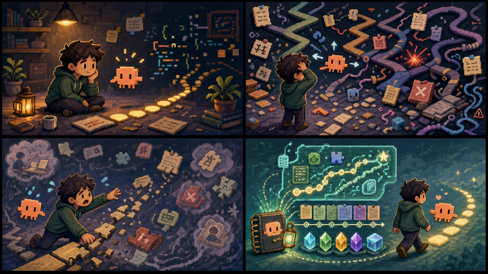
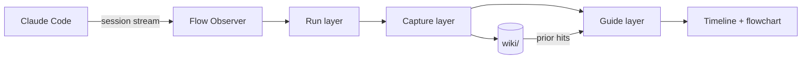

<p align="center">
  
</p>

<h1 align="center">GUI-Anything</h1>

<p align="center"><strong>The flight recorder for long Claude Code sessions.</strong></p>

<p align="center">
  <strong>English</strong> · <a href="README_CN.md">简体中文</a>
</p>

<p align="center">
  <a href="#quick-start">⚡ Quick Start</a> &nbsp;·&nbsp;
  <a href="#sidecar-view">🪟 Sidecar View</a> &nbsp;·&nbsp;
  <a href="#why-it-is-different">✨ Why Different</a> &nbsp;·&nbsp;
  <a href="#how-it-works">🧭 How It Works</a> &nbsp;·&nbsp;
  <a href="#demo-gallery">🎬 Demos</a> &nbsp;·&nbsp;
  <a href="#contributing">🤝 Contribute</a> &nbsp;·&nbsp;
  <a href="#faq">❓ FAQ</a> &nbsp;·&nbsp;
  <a href="#acknowledgements">🙏 Acknowledgements</a>
</p>

<p align="center">
  <a href="https://opensource.org/licenses/MIT"></a>
  
  
  
</p>

<p align="center">
  
  
  
</p>

<br>

> **GUI-Anything** is a sidecar for long Claude Code sessions. Claude keeps coding in the left pane; the Flow Observer watches from the right, turns scrollback into a live map, and brings useful project memory back when you need it — without wrapping or driving the agent.
>
> **Run / Capture / Guide by design:** the observer reads the session stream in real time, distills summaries and intent graphs on demand, and surfaces prior local wiki hits while the current exploration is still running.
>
> <p align="center"><strong>⭐ Star this project if you want a local-first flight recorder for vibe coding sessions, thank you!</strong></p>

<p align="center">
  
</p>

<p align="center"><em>Long sessions move fast. GUI-Anything keeps the trail.</em></p>

<table align="center">
<tr>
<td align="center" width="33%">
<strong>Run</strong><br><br>
Claude Code stays native in the left pane. The observer shows explorations, tools, phases, and errors in real time.
</td>
<td align="center" width="33%">
<strong>Capture</strong><br><br>
The right pane turns long scrollback into summaries, flowchart hints, and intent-aware context.
</td>
<td align="center" width="33%">
<strong>Guide</strong><br><br>
Relevant project memory appears inline while the current exploration is still running. Resume keeps the story intact.
</td>
</tr>
</table>

---

## Quick Start

### Happy Path

```bash
git clone https://github.com/YurunChen/GUI-Anything.git
cd GUI-Anything
./scripts/setup.sh
ga doctor
ga flow
```

`ga flow` opens a Zellij dual-pane layout: Claude Code on the left, Flow Observer on the right. In the observer, press `h` for project evolution HTML or `r` for AI-enriched regeneration.

### Prerequisites

- **[Claude Code CLI](https://docs.anthropic.com/en/docs/claude-code)** — the agent GUI-Anything observes
- **[Bun](https://bun.sh)** — runtime for the observer and tests
- **[Zellij](https://zellij.dev)** — dual-pane launcher used by `ga flow`

### Everyday Commands

| Command | Purpose |
|---------|---------|
| `ga doctor` | Verify dependencies and environment |
| `ga flow` | Start dual-pane Claude Code + observer |
| `ga flow --continue` | Continue session; summarize only new explorations |
| `ga flow --resume <session-id>` | Replay saved session data |
| `ga flow --model sonnet "your task"` | Start with a specific model and prompt |
| `ga flow --watch --open` | Start the live project evolution browser sidecar |
| `./scripts/flow-run.sh --cleanup` | Tear down stale flow runtime |

### Verify Setup

```bash
ga doctor
cd scheme && bun test && bunx tsc --noEmit
```

`ga doctor` should report Claude Code, Bun, and Zellij as available. The scheme checks are the minimum bar before opening a PR.

---

## Sidecar View

GUI-Anything is a **sidecar**. Claude Code stays native, while the observer renders the session as timeline, flowchart, summaries, and project memory.

| Left pane | Right pane |
|-----------|------------|
| Claude Code runs unchanged | Flow Observer watches the session in real time |
| You keep the normal terminal workflow | Timeline, phase badges, tools, errors, and summaries stay visible |
| No wrapper controls the agent | Useful context is saved locally for later |
| Your session can stay messy | The map stays readable after the conversation gets long |

Focus the **right pane** first, then use:

| Key | Action |
|-----|--------|
| `g` | Timeline / flowchart |
| `i` | Notes sidebar |
| `?` / `/` / `Ctrl-K` | Help |
| `c` | Calm mode |
| `[` `]` | Previous / next theme |
| `k` | Flag a wrong wiki match |
| `h` | Export and open project evolution HTML |
| `r` | Regenerate project evolution HTML with AI enrichment |
| `q` | Quit observer |

Chinese UI: `FLOW_LOCALE=zh-Hans`.

After each stable window of three completed explorations, the observer can show a localized `Personality` strip above the command bar. The HTML evolution export keeps the richer persona card for sharing.

---

## Memory Layer

Most coding agents can generate. Fewer tools help you remember what just happened. GUI-Anything keeps three linked views of the same work:

| Layer | What it captures | What you get back |
|-------|------------------|-------------------|
| **Run** | Explorations, tool calls, errors, phases | A live session timeline instead of raw scrollback |
| **Capture** | Summaries, flowchart hints, intent buckets | The shape of the work, not just the transcript |
| **Guide** | Prior wiki matches and focused trails | Context from past sessions while the current turn is still running |

Project memory stays local by default. Related turns accumulate by intent; curation happens on pivot or idle sweep, not every exploration.

---

## Why It Is Different

- 🪟 **Sidecar, not wrapper.** Claude Code stays native in the left pane. GUI-Anything observes instead of taking over.
- 🗺️ **Live map, not scrollback.** Exploration turns become a readable intent graph with responsive terminal layouts.
- 🧠 **Memory while you work.** Prior local wiki entries surface inline while the current exploration is still running.
- 🧷 **Intent-aware curation.** Same-task turns compound into a bucket; pivot or idle sweep writes durable context.
- ⏪ **Honest resume.** `--resume` replays saved session data. It does not silently rebuild the story.
- 🔁 **Continue without drift.** `--continue` keeps existing context and summarizes only new explorations.
- 🎨 **33 terminal themes.** Hot-swap with `[` and `]`; Spectra is the kinetic showcase.
- 📤 **Shareable HTML.** Export a project evolution page, single-session drill-down, or knowledge graph.
- 🌐 **Web Mirror.** Watch progress from a browser when the terminal is not the best display.
- 📱 **WeChat notifications.** Walk away and still catch errors or milestones.

| Typical long-session coding | GUI-Anything |
|-----------------------------|--------------|
| Raw terminal scrollback only | Live timeline, phases, tools, and errors |
| Context disappears between sessions | Local wiki retrieval surfaces prior work inline |
| Resume rebuilds or re-summarizes silently | Strict replay; continue only fills new explorations |
| Wrapper controls the agent | Native Claude Code sidecar |
| Every turn writes durable memory | Intent buckets; curation on pivot or idle sweep |
| Output judged by vibe only | KNOWLEDGE hits can be audited with `k` |

---

## Demo Gallery

Planned screen recordings for this section (see [Roadmap](#roadmap)):

| File | Length | Story |
|------|--------|-------|
| `assets/demo/hero.mp4` / `hero.gif` | 12–18s | Start `ga flow`, then watch timeline and flowchart update |
| `assets/demo/knowledge.gif` | 8–12s | A prior wiki hit appears inline, then `k` audits a bad match |
| `assets/demo/resume.gif` | 8–12s | `ga flow --resume <id>` replays without re-summary |

Static preview: [`assets/demo/readme-hero.svg`](assets/demo/readme-hero.svg).

---

## How It Works

```text
Run      Session stream → explorations, tools, errors, phases
Capture  AI summaries, flowchart hints, intent buckets, wiki curation
Guide    prior wiki matches, flowchart, notes, hotkeys
```



More detail: [data flow](docs/data-governance/data-flow.md) · [development guide](docs/development.md) · [agent rules](AGENTS.md)

---

## Optional Superpowers

<details>
<summary><strong>HTML export</strong> — project evolution, mirror, knowledge graph</summary>

```bash
# Project evolution, defaulting to all sessions in this workspace.
ga export -o evolution.html

# In ga flow, press h to export and open the project evolution page.
# Press r for AI-enriched regeneration from the observer.

# Live project evolution sidecar during a flow session.
ga flow --watch --open

# Single-session drill-down.
ga export --scope session --session-id <id> -o evo.html

# Skip AI era synthesis, using deterministic rule grouping.
ga export --no-ai --theme catppuccin -o evo.html

# Real-time browser view.
cd scheme
FLOW_PROJECT_DIR=/path/to/repo FLOW_SESSION_ID=<uuid> \
  bun run src/main.ts --web-mirror --port 3001

# Force-directed graph from local wiki.
bun run src/main.ts --knowledge-graph -o graph.html
```

See [docs/IDEAS_HTML_INTEGRATION.md](docs/IDEAS_HTML_INTEGRATION.md).

</details>

<details>
<summary><strong>Notifications</strong> — WeChat</summary>

```bash
ga notify setup
ga flow

# Reset local WeChat notification state if setup needs to be redone.
ga notify clean
```

See [docs/NOTIFICATION.md](docs/NOTIFICATION.md) and [docs/NOTIFICATION_WECHAT.md](docs/NOTIFICATION_WECHAT.md).

</details>

<details>
<summary><strong>llm-wiki</strong> — agentic knowledge ingest</summary>

Wiki curation uses the `/llm-wiki` skill in [skills/llm-wiki](skills/llm-wiki/).

```bash
./scripts/setup.sh
./scripts/wiki/wiki-maintain.sh
```

See [scripts/wiki/README.md](scripts/wiki/README.md).

</details>

---

## Project Status

GUI-Anything is early but usable. The core Claude Code sidecar path is the supported path.

| Area | Status |
|------|--------|
| `ga flow` dual-pane launcher | Supported |
| Claude Code session observer | Supported |
| Local wiki retrieval and curation | Supported |
| Strict resume / continue replay | Supported |
| HTML export / Web Mirror | Experimental |
| Other agent backends | Not yet supported |

---

## Roadmap

- Record real `ga flow` demo videos for the README gallery
- Improve Web Mirror polish for phone and tablet monitoring
- Add importers for session formats beyond Claude Code
- Expand wiki maintenance reports and bad-match audit workflows
- Package more themes and terminal layouts

---

## Contributing

Issues and PRs are welcome. Start here:

| Doc | For |
|-----|-----|
| [CONTRIBUTING.md](CONTRIBUTING.md) | Local setup, verification, PR checklist |
| [docs/development.md](docs/development.md) | Architecture and extension guide |
| [AGENTS.md](AGENTS.md) | Coding-agent principles and red lines |
| [docs/data-governance/data-flow.md](docs/data-governance/data-flow.md) | Wiki and session data flow |
| [docs/THEMES.md](docs/THEMES.md) | Theme catalog |

Minimum verification:

```bash
cd scheme && bun test && bunx tsc --noEmit
ga doctor
```

Please do not commit `wiki/`, `.flow-runtime/`, local logs, or secrets.

---

## FAQ

<details>
<summary><strong>Does GUI-Anything replace or control Claude Code?</strong></summary>

No. It is a sidecar. It watches the session stream, renders the observer, and saves local context. Claude Code runs unchanged.

</details>

<details>
<summary><strong>Does every exploration write to wiki?</strong></summary>

No. Related turns accumulate by intent. Wiki curation runs on intent pivot or idle sweep, not every turn.

</details>

<details>
<summary><strong>What is the difference between KNOWLEDGE and wiki saved?</strong></summary>

`KNOWLEDGE` is prior retrieval from existing local wiki content. `wiki saved` means this session curated and wrote new content. They are independent.

</details>

<details>
<summary><strong>Can I use it with Cursor or other agents?</strong></summary>

Not yet. The observer pattern is agent-agnostic, but this repo currently supports Claude Code sessions.

</details>

<details>
<summary><strong>Where does data live?</strong></summary>

By default, in `<repo>/wiki/`, which is gitignored. Override with `FLOW_WIKI_DIR`.

</details>

---

## License

MIT. Claude Code and third-party tools are subject to their own terms.

## Acknowledgements

GUI-Anything is developed by the [AI4GC Lab](https://ai4gc.org/) at Zhejiang University.

<p align="center">
  <strong>Stop losing the thread.</strong><br>
  Give long agent sessions a map, a memory, and a replay button.
</p>
