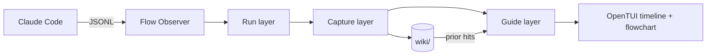

<p align="right">
  <strong>English</strong> · <a href="README_CN.md">简体中文</a>
</p>

<p align="center">
  <b>GUI-Anything</b><br>
  <i>A memory layer for Claude Code sessions.</i>
</p>

<p align="center">
  Claude keeps coding. GUI-Anything keeps the map: live timeline, intent flowchart,
  and a local wiki that compounds across sessions.
</p>

<p align="center">
  <a href="#-quick-start"><b>Quick Start</b></a> ·
  <a href="#-demo"><b>Demo</b></a> ·
  <a href="#-why-it-exists"><b>Why</b></a> ·
  <a href="#-how-it-works"><b>Architecture</b></a> ·
  <a href="#-contributing"><b>Contributing</b></a>
</p>

<p align="center">
  <a href="https://www.npmjs.com/package/gui-anything"></a>
  <a href="package.json"></a>
  
  
  
</p>

<p align="center">
  
</p>

<p align="center">
  <b>One command. Two panes. No lost context.</b>
</p>

---

## Quick Start

**Requirements:** [Claude Code CLI](https://docs.anthropic.com/en/docs/claude-code) · [Bun](https://bun.sh) · [Zellij](https://zellij.dev)

Published package:

```bash
npm i -g gui-anything
ga doctor
ga flow
```

From source:

```bash
git clone https://github.com/YurunChen/GUI-Anything.git
cd GUI-Anything
./scripts/setup.sh
ga doctor
ga flow
```

Everyday commands:

```bash
ga doctor
ga flow
```

**Common commands**

```bash
ga flow                              # new session
ga flow --continue                   # pick up latest work
ga flow --resume <session-id>        # strict replay (no AI re-summary)
ga flow --model sonnet "your task"   # pass a model + prompt
./scripts/flow-run.sh --cleanup      # kill stale zellij / orphan processes
```

---

## What makes it fun

| | Feature | Why you’ll care |
|---|---------|-----------------|
| 🪟 | **Dual-pane Flow** | Claude stays native; observer watches in real time |
| 🗺️ | **Live flowchart** | Tree with connectors — rail / stack / grid by terminal width |
| 📇 | **Inline wiki hits** | Prior knowledge surfaces on each exploration card |
| 🪣 | **Intent-aware wiki** | Same task compounds in a bucket; pivot closes it → `/llm-wiki` agent writes `contexts/` |
| 🎨 | **8 themes** | Hot-swap — `[` `]` · Spectra = full kinetic showcase |
| 📱 | **Web Mirror** | Watch progress in the browser (phone-friendly WebSocket) |
| 🎬 | **Project Evolution HTML** | Self-contained page: scroll the milestone timeline, left rail abstracts the project's evolution into eras (AI-synthesized, rule fallback) |
| 🔔 | **Push notifications** | WeChat / Feishu / DingTalk when errors or milestones hit |
| ⏪ | **Honest resume** | `-r` replays cache — won’t silently re-run summary AI |
| ↩️ | **Continue** | `-c` reloads `wiki/sessions/{id}/bundle.json`; only new explorations trigger summary AI |

---

## Observer at a glance

**Run → Capture → Guide**

```text
Run      JSONL → explorations, tools, errors, phases
Capture  AI summaries, flowchart hints, intent buckets, wiki
Guide    prior wiki matches, flowchart, hotkeys
```

Focus the **right pane** first, then:

| Key | Action |
|-----|--------|
| `g` | Timeline / flowchart |
| `i` | Notes sidebar |
| `?` / `/` / `Ctrl-K` | Help |
| `c` | Calm mode |
| `[` `]` | Previous / next theme |
| `k` | Flag a wrong wiki match |
| `h` | Export and open current session HTML |
| `q` | Quit observer |

Chinese UI: `FLOW_LOCALE=zh-Hans`.

---

## Demo

GUI-Anything is a sidecar, not a replacement shell. Claude Code stays native on the left; the observer watches from the right.

| Moment | What you see |
|--------|--------------|
| **Live map** | Exploration cards, tool traces, phase badges, and a responsive flowchart |
| **Prior knowledge** | `KNOWLEDGE` hits appear while an exploration is still running |
| **Intent memory** | Related turns accumulate in a bucket; pivot/idle curation writes local wiki contexts |
| **Honest resume** | `-r` replays the bundle exactly; `-c` summarizes only new explorations |
| **Shareable replay** | Export a single-file HTML session replay or open Web Mirror |

For launch videos, drop recordings into `assets/demo/` and replace the hero with a real `ga flow` capture. Recommended cuts:

| File | Length | Story |
|------|--------|-------|
| `hero.mp4` / `hero.gif` | 12-18s | Start `ga flow`, watch timeline + flowchart update |
| `knowledge.gif` | 8-12s | Prior wiki hit appears inline, then `k` audits a bad match |
| `resume.gif` | 8-12s | `ga flow -r <id>` replays without re-summary |

---

## Why It Exists

Long Claude Code sessions are productive, but they can become hard to read after the fact:

| Pain | What happens |
|------|--------------|
| **No map** | Tool calls pile up; the shape of the work disappears |
| **No durable memory** | Useful discoveries stay in chat scrollback |
| **Expensive resume** | Reopening a session can mean re-reading or re-summarizing everything |
| **Broken flow** | Jumping to logs and JSONL breaks attention |

GUI-Anything adds the missing layer: a local, read-only observer that turns a session into a map, then lets useful context survive into the next session.

**Claude does the work. GUI-Anything remembers where you have been.**

---

## What You Get

| | Feature | Why it matters |
|:---:|---------|----------------|
| Flow | **Native dual-pane Claude** | No wrapper. No takeover. Claude runs unchanged. |
| Map | **Timeline + flowchart** | See exploration, pivots, tools, errors, and current intent. |
| Memory | **Local wiki retrieval** | Prior project knowledge surfaces inline as `KNOWLEDGE`. |
| Capture | **Intent-aware curation** | Same task compounds; pivot/idle writes curated `contexts/`. |
| Resume | **Bundle replay** | `-r` is strict cache replay; `-c` only summarizes new work. |
| Taste | **8 themes** | Transparent … Aurora · **Spectra** (max motion). |
| Share | **HTML export + Web Mirror** | Review offline or watch progress in a browser. |
| Notify | **WeChat / Feishu / DingTalk** | Walk away and still catch errors or milestones. |

---

## Design Philosophy

Built around three product principles:

| Principle | In practice |
|-----------|-------------|
| **Flow first** | No persistent popups. Notes and help only appear on hotkeys. |
| **Knowledge on demand** | Retrieval is live; wiki writes happen on pivot or idle, not every turn. |
| **Local by default** | `wiki/` lives in your repo root and stays gitignored. |

And three engineering rules:

| Rule | Meaning |
|------|---------|
| **Sidecar, not wrapper** | GUI-Anything reads Claude JSONL; it does not drive Claude. |
| **Single source of truth** | Session binding, resume, wiki curation, and summary policy each live in one module. |
| **Small, verifiable changes** | Bun tests, TypeScript checks, and docs move with behavior. |

---

## How It Works

```text
Run      JSONL -> explorations, tools, errors, phases
Capture  AI summaries, flowchart hints, intent buckets, wiki curation
Guide    prior wiki matches, flowchart, notes, hotkeys
```



All derived data is local:

```text
wiki/
├── knowledge/              # long-lived markdown contexts/entities
├── sessions/
│   ├── _index.json         # continue/resume index
│   └── {id}/bundle.json    # summaries, retrieval, curation, flow graph
└── notes/
```

More detail: [data flow](docs/data-governance/data-flow.md) · [development guide](docs/development.md) · [agent rules](AGENTS.md)

---

## Optional Superpowers

<details>
<summary><b>HTML export</b> — project evolution, mirror, knowledge graph</summary>

```bash
cd scheme

# Project evolution (default: all sessions in this workspace)
bun run src/main.ts --export-html -o evolution.html
# In ga flow, press h to export and open the current session page.

# Drill into a single session
bun run src/main.ts --export-html --scope session --session-id <id> -o evo.html

# Skip AI era synthesis (deterministic rule grouping)
bun run src/main.ts --export-html --no-ai --theme catppuccin -o evo.html

# Real-time browser view
FLOW_PROJECT_DIR=/path/to/repo FLOW_SESSION_ID=<uuid> \
  bun run src/main.ts --web-mirror --port 3001

# Force-directed graph from local wiki
bun run src/main.ts --knowledge-graph -o graph.html
```

See [docs/IDEAS_HTML_INTEGRATION.md](docs/IDEAS_HTML_INTEGRATION.md) and [docs/IMPLEMENTATION_PLAN.md](docs/IMPLEMENTATION_PLAN.md).
</details>

<details>
<summary><b>Notifications</b> - WeChat / Feishu / DingTalk</summary>

```bash
./scripts/start-weixin-service.sh
./scripts/weixin-login.sh
FLOW_NOTIFY_WECHAT_USER_ID=<id> ga flow
```

See [docs/NOTIFICATION.md](docs/NOTIFICATION.md) and [docs/NOTIFICATION_WECHAT.md](docs/NOTIFICATION_WECHAT.md).
</details>

<details>
<summary><b>llm-wiki</b> - agentic knowledge ingest</summary>

Wiki curation uses the `/llm-wiki` skill in [skills/llm-wiki](skills/llm-wiki/).

```bash
./scripts/setup.sh
./scripts/wiki/wiki-maintain.sh
```

See [scripts/wiki/README.md](scripts/wiki/README.md).
</details>

---

## Project Status

GUI-Anything is early but usable. The core Claude Code sidecar path is the supported path today:

| Area | Status |
|------|--------|
| `ga flow` dual-pane launcher | Supported |
| Claude Code JSONL observer | Supported |
| Local wiki retrieval and curation | Supported |
| Strict resume / continue bundle | Supported |
| HTML export / Web Mirror | Experimental |
| Other agent backends | Not yet supported |

---

## Roadmap

- Record real `ga flow` demo videos for the README gallery
- Improve Web Mirror polish for phone/tablet monitoring
- Add more importers for session formats beyond Claude Code JSONL
- Expand wiki maintenance reports and bad-match audit workflows
- Package more themes and terminal layouts

---

## Contributing

Issues and PRs are welcome. Start here:

| Doc | For |
|-----|-----|
| [CONTRIBUTING.md](CONTRIBUTING.md) | Local setup, verification, PR checklist |
| [docs/development.md](docs/development.md) | Architecture and extension guide |
| [AGENTS.md](AGENTS.md) | Coding-agent principles and red lines |
| [docs/data-governance/data-flow.md](docs/data-governance/data-flow.md) | Wiki and session data flow |
| [docs/THEMES.md](docs/THEMES.md) | Theme catalog |

Minimum verification:

```bash
cd scheme && bun test && bunx tsc --noEmit
ga doctor
```

Please do not commit `wiki/`, `.flow-runtime/`, local logs, or secrets.

---

## FAQ

<details>
<summary><b>Does GUI-Anything replace or control Claude Code?</b></summary>

No. It is a read-only sidecar. It watches JSONL, renders the observer, and writes derived local data to `wiki/`. Claude Code runs unchanged.
</details>

<details>
<summary><b>Does every exploration write to wiki?</b></summary>

No. Related turns accumulate by intent. Wiki curation runs on intent pivot or idle sweep, not every turn.
</details>

<details>
<summary><b>What is the difference between KNOWLEDGE and wiki saved?</b></summary>

`KNOWLEDGE` is prior retrieval from existing local wiki content. `wiki saved` means this session curated and wrote new content. They are independent.
</details>

<details>
<summary><b>Can I use it with Cursor or other agents?</b></summary>

Not yet. The observer pattern is agent-agnostic, but this repo currently supports Claude Code JSONL sessions.
</details>

<details>
<summary><b>Where does data live?</b></summary>

By default, in `<repo>/wiki/`, which is gitignored. Override with `FLOW_WIKI_DIR`.
</details>

---

## License

MIT. Claude Code and third-party tools are subject to their own terms.

<p align="center">
  <b>Stop parsing JSONL by hand.</b><br>
  Star the repo if a calm sidecar beats losing the thread.
</p>
