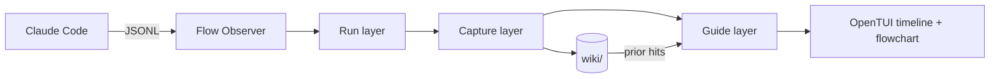

<p align="right">
  <a href="README.md">English</a> · <strong>简体中文</strong>
</p>

<p align="center">
  <b>GUI-Anything</b><br>
  <i>Claude Code 会话的记忆层。</i>
</p>

<p align="center">
  Claude 继续写代码，GUI-Anything 替你保留地图：实时时间线、意图流程图、
  以及跨 session 复利的本地 wiki。
</p>

<p align="center">
  <a href="#-快速开始"><b>快速开始</b></a> ·
  <a href="#-演示"><b>演示</b></a> ·
  <a href="#-为什么需要它"><b>为什么</b></a> ·
  <a href="#-工作原理"><b>架构</b></a> ·
  <a href="#-参与贡献"><b>参与贡献</b></a>
</p>

<p align="center">
  <a href="https://www.npmjs.com/package/gui-anything"></a>
  <a href="package.json"></a>
  
  
  
</p>

<p align="center">
  
</p>

<p align="center">
  <b>一条命令。双栏同屏。上下文不丢。</b>
</p>

---

## 快速开始

**依赖：** [Claude Code CLI](https://docs.anthropic.com/en/docs/claude-code) · [Bun](https://bun.sh) · [Zellij](https://zellij.dev)

发布包安装：

```bash
npm i -g gui-anything
ga doctor
ga flow
```

源码安装：

```bash
git clone https://github.com/YurunChen/GUI-Anything.git
cd GUI-Anything
./scripts/setup.sh
ga doctor
ga flow
```

常用命令：

```bash
ga flow                              # 启动新的 Claude + Observer session
ga flow --continue                   # 接续最近 session
ga flow --resume <session-id>        # 严格回放，不重跑摘要 AI
ga flow --model sonnet "your task"   # 透传 Claude 参数
./scripts/flow-run.sh --cleanup      # 清理残留 zellij / 进程状态
```

先聚焦**右栏**，再操作：

| 按键 | 动作 |
|------|------|
| `g` | 时间线 / 流程图 |
| `i` | 笔记侧栏 |
| `?` / `/` / `Ctrl-K` | 帮助 |
| `c` | Calm 模式 |
| `[` `]` | 上一 / 下一主题 |
| `k` | 标记错误 wiki 命中 |
| `h` | 导出并打开当前 session HTML |
| `q` | 退出观察器 |

中文界面：`FLOW_LOCALE=zh-Hans`。

---

## 演示

GUI-Anything 是 sidecar，不是替代 shell。Claude Code 原样运行在左栏；观察器安静地在右栏记录。

| 时刻 | 你会看到 |
|------|----------|
| **实时地图** | Exploration 卡片、工具轨迹、phase badge、自适应流程图 |
| **Prior 知识** | exploration 还在 running 时，`KNOWLEDGE` 命中已经出现 |
| **Intent 记忆** | 相关轮次进入同一个 bucket；pivot/idle 后写成本地 wiki contexts |
| **诚实 resume** | `-r` 精确回放 bundle；`-c` 只摘要新增 exploration |
| **可分享回放** | 导出单文件 HTML session replay，或打开 Web Mirror |

正式发布视频可放进 `assets/demo/`，直接替换 hero。推荐录三段：

| 文件 | 时长 | 故事 |
|------|------|------|
| `hero.mp4` / `hero.gif` | 12-18s | 启动 `ga flow`，时间线和流程图同步更新 |
| `knowledge.gif` | 8-12s | Prior wiki 命中出现，再用 `k` 审计错误匹配 |
| `resume.gif` | 8-12s | `ga flow -r <id>` 无 re-summary 回放 |

---

## 为什么需要它

长 Claude Code 会话很高效，但事后常常难读：

| 痛点 | 具体表现 |
|------|----------|
| **没有地图** | tool call 堆起来以后，工作形状消失 |
| **没有持久记忆** | 有价值的发现停在聊天滚动区 |
| **恢复昂贵** | 重开 session 可能要重读或重摘要所有内容 |
| **心流被打断** | 切到 log 和 JSONL 会破坏注意力 |

GUI-Anything 补上缺失的一层：本地、只读、旁路观察，把 session 变成地图，也让重要上下文活到下一个 session。

**Claude 负责推进，GUI-Anything 记住你走到哪里。**

---

## 你能得到什么

| | 能力 | 为什么重要 |
|:---:|------|------------|
| Flow | **原生 Claude 双栏** | 不套壳，不接管，Claude 原样运行。 |
| Map | **时间线 + 流程图** | 看清 exploration、pivot、工具、错误和当前 intent。 |
| Memory | **本地 wiki 检索** | prior 项目知识以 `KNOWLEDGE` 形式 inline 出现。 |
| Capture | **Intent 感知策展** | 同任务复利；pivot/idle 后写入 curated `contexts/`。 |
| Resume | **Bundle 回放** | `-r` 严格缓存回放；`-c` 只摘要新增工作。 |
| Taste | **33 套主题** | Transparent、Apple System、莫兰迪循环、明暗主题，原地热切换。 |
| Share | **HTML 导出 + Web Mirror** | 离线回顾，或在浏览器里看进度。 |
| Notify | **微信 / 飞书 / 钉钉** | 离开电脑也能收到错误和里程碑。 |

---

## 设计理念

三个产品原则：

| 原则 | 落地方式 |
|------|----------|
| **心流优先** | 没有常驻弹窗；笔记和帮助只用快捷键打开。 |
| **按需知识** | 检索实时发生；wiki 写入只在 pivot 或 idle，不是每轮都写。 |
| **默认本地** | `wiki/` 在仓库根目录，并保持 gitignored。 |

三个工程规则：

| 规则 | 含义 |
|------|------|
| **Sidecar，不是 wrapper** | GUI-Anything 读取 Claude JSONL，不驱动 Claude。 |
| **单一真相源** | Session binding、resume、wiki curation、summary policy 各在一个权威模块。 |
| **小步可验证** | Bun 测试、TypeScript 检查、文档跟随行为变化。 |

---

## 工作原理

```text
Run      JSONL -> explorations、tools、errors、phases
Capture  AI 摘要、flowchart hint、intent bucket、wiki curation
Guide    prior wiki 匹配、flowchart、notes、hotkeys
```



所有派生数据都在本地：

```text
wiki/
├── knowledge/              # 长期 markdown contexts/entities
├── sessions/
│   ├── _index.json         # continue/resume 索引
│   └── {id}/bundle.json    # 摘要、检索、策展、流程图
└── notes/
```

更多细节：[数据流](docs/data-governance/data-flow.md) · [开发指南](docs/development.md) · [Agent 规则](AGENTS.md)

---

## 可选能力

<details>
<summary><b>HTML 导出</b> - 回放、镜像、知识图谱</summary>

```bash
cd scheme

# 单文件交互式回放
bun run src/main.ts --export-html -o replay.html

# 浏览器实时视图
FLOW_PROJECT_DIR=/path/to/repo FLOW_SESSION_ID=<uuid> \
  bun run src/main.ts --web-mirror --port 3001

# 本地 wiki 力导向图
bun run src/main.ts --knowledge-graph -o graph.html
```

见 [docs/IDEAS_HTML_INTEGRATION.md](docs/IDEAS_HTML_INTEGRATION.md) 与 [docs/IMPLEMENTATION_PLAN.md](docs/IMPLEMENTATION_PLAN.md)。
</details>

<details>
<summary><b>推送通知</b> - 微信 / 飞书 / 钉钉</summary>

```bash
./scripts/start-weixin-service.sh
./scripts/weixin-login.sh
FLOW_NOTIFY_WECHAT_USER_ID=<id> ga flow
```

见 [docs/NOTIFICATION.md](docs/NOTIFICATION.md) 与 [docs/NOTIFICATION_WECHAT.md](docs/NOTIFICATION_WECHAT.md)。
</details>

<details>
<summary><b>llm-wiki</b> - Agent 化知识入库</summary>

Wiki 策展使用 [skills/llm-wiki](skills/llm-wiki/) 里的 `/llm-wiki` skill。

```bash
./scripts/setup.sh
./scripts/wiki/wiki-maintain.sh
```

见 [scripts/wiki/README.md](scripts/wiki/README.md)。
</details>

---

## 项目状态

GUI-Anything 还早，但核心路径已经可用。目前支持的是 Claude Code sidecar：

| 区域 | 状态 |
|------|------|
| `ga flow` 双栏启动器 | 支持 |
| Claude Code JSONL 观察器 | 支持 |
| 本地 wiki 检索与策展 | 支持 |
| 严格 resume / continue bundle | 支持 |
| HTML 导出 / Web Mirror | 实验性 |
| 其他 Agent 后端 | 暂未支持 |

---

## Roadmap

- 为 README 录制真实 `ga flow` 演示视频
- 打磨 Web Mirror 的手机 / 平板监控体验
- 支持 Claude Code JSONL 之外的更多 session 格式
- 扩展 wiki 维护报告和错误命中审计流程
- 打包更多主题与终端 layout

---

## 参与贡献

欢迎 Issue 和 PR。先看这些：

| 文档 | 面向 |
|------|------|
| [CONTRIBUTING.md](CONTRIBUTING.md) | 本地搭建、验证、PR checklist |
| [docs/development.md](docs/development.md) | 架构与扩展指南 |
| [AGENTS.md](AGENTS.md) | Coding Agent 原则与红线 |
| [docs/data-governance/data-flow.md](docs/data-governance/data-flow.md) | Wiki 与 session 数据流 |
| [docs/THEMES.md](docs/THEMES.md) | 主题目录 |

最低验证：

```bash
cd scheme && bun test && bunx tsc --noEmit
ga doctor
```

请不要提交 `wiki/`、`.flow-runtime/`、本地 log 或密钥。

---

## 常见问题

<details>
<summary><b>GUI-Anything 会替代或控制 Claude Code 吗？</b></summary>

不会。它是只读 sidecar：读取 JSONL、渲染观察器，并把派生数据写入本地 `wiki/`。Claude Code 原样运行。
</details>

<details>
<summary><b>每个 exploration 都会写 wiki 吗？</b></summary>

不会。相关轮次按 intent 积累。Wiki 策展在 intent pivot 或 idle sweep 时触发，不是每轮都写。
</details>

<details>
<summary><b>KNOWLEDGE 和 wiki saved 有什么区别？</b></summary>

`KNOWLEDGE` 是对已有本地 wiki 的 prior 检索。`wiki saved` 表示本次 session 策展并写入新内容。二者独立。
</details>

<details>
<summary><b>能和 Cursor 或其他 Agent 一起用吗？</b></summary>

暂时不能。Observer 模式本身与 Agent 无关，但本仓库目前支持 Claude Code JSONL sessions。
</details>

<details>
<summary><b>数据存在哪里？</b></summary>

默认在 `<repo>/wiki/`，该目录 gitignored。可用 `FLOW_WIKI_DIR` 覆盖。
</details>

---

## 许可证

MIT。Claude Code 与第三方工具适用各自条款。

<p align="center">
  <b>别再手 parse JSONL 了。</b><br>
  如果一个安静 sidecar 比跨 session 失忆更好，欢迎 Star。
</p>
