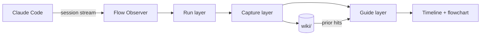

<p align="center">
  
</p>

<h1 align="center">GUI-Anything</h1>

<p align="center"><strong>长 Claude Code 会话的飞行记录器。</strong></p>

<p align="center">
  <a href="README.md">English</a> · <strong>简体中文</strong>
</p>

<p align="center">
  <a href="#快速开始">⚡ 快速开始</a> &nbsp;·&nbsp;
  <a href="#sidecar-视图">🪟 Sidecar 视图</a> &nbsp;·&nbsp;
  <a href="#为何不同">✨ 为何不同</a> &nbsp;·&nbsp;
  <a href="#工作原理">🧭 工作原理</a> &nbsp;·&nbsp;
  <a href="#演示画廊">🎬 演示</a> &nbsp;·&nbsp;
  <a href="#参与贡献">🤝 参与贡献</a> &nbsp;·&nbsp;
  <a href="#常见问题">❓ 常见问题</a> &nbsp;·&nbsp;
  <a href="#致谢">🙏 致谢</a>
</p>

<p align="center">
  <a href="https://opensource.org/licenses/MIT"></a>
  
  
  
</p>

<p align="center">
  
  
  
</p>

<br>

> **GUI-Anything** 是长 Claude Code 会话的 sidecar。Claude 继续在左栏写代码；Flow Observer 在右栏观察，把滚动区变成实时地图，并在需要时带回有用的项目记忆 —— 同时不包裹也不驱动 Agent。
>
> **Run / Capture / Guide 设计：** Observer 实时读取 session stream，按需提炼摘要与意图图，并在当前 exploration 仍在进行时就把本地 wiki 中的 prior 命中带回来。
>
> <p align="center"><strong>⭐ 如果你想要一个本地优先的 vibe coding 飞行记录器，欢迎 Star 本项目，谢谢！</strong></p>

<p align="center">
  
</p>

<p align="center"><em>长会话很快会失去线索；GUI-Anything 负责把路径留下来。</em></p>

<table align="center">
<tr>
<td align="center" width="33%">
<strong>Run</strong><br><br>
Claude Code 保持原生左栏体验。右栏实时展示探索、工具、阶段和错误。
</td>
<td align="center" width="33%">
<strong>Capture</strong><br><br>
长滚动区会被整理成摘要、流程图线索和按意图聚合的上下文。
</td>
<td align="center" width="33%">
<strong>Guide</strong><br><br>
相关项目记忆会在当前探索仍在进行时出现。Resume 保持上下文连续。
</td>
</tr>
</table>

---

## 快速开始

### 推荐路径

```bash
git clone https://github.com/YurunChen/GUI-Anything.git
cd GUI-Anything
./scripts/setup.sh
ga doctor
ga flow
```

`ga flow` 会打开 Zellij 双栏布局：左侧 Claude Code，右侧 Flow Observer。在 observer 中按 `h` 导出并打开项目演进 HTML，按 `r` 使用 AI enrichment 重生成。

### 依赖

- **[Claude Code CLI](https://docs.anthropic.com/en/docs/claude-code)** — 当前 GUI-Anything 观察的 Agent
- **[Bun](https://bun.sh)** — Observer 与测试的运行时
- **[Zellij](https://zellij.dev)** — `ga flow` 使用的双栏启动器

### 常用命令

| 命令 | 用途 |
|------|------|
| `ga doctor` | 检查依赖与环境 |
| `ga flow` | 启动 Claude Code + 观察器双栏 |
| `ga flow --continue` | 继续会话；仅为新探索补摘要 |
| `ga flow --resume <session-id>` | 回放已保存的 session 数据 |
| `ga flow --model sonnet "your task"` | 指定模型与初始 prompt 启动 |
| `ga flow --watch --open` | 启动项目演进 live browser sidecar |
| `./scripts/flow-run.sh --cleanup` | 清理残留的 flow runtime |

### 验证环境

```bash
ga doctor
cd scheme && bun test && bunx tsc --noEmit
```

`ga doctor` 应报告 Claude Code、Bun、Zellij 可用。scheme 检查是提 PR 前的最低门槛。

---

## Sidecar 视图

GUI-Anything 是 **sidecar**。Claude Code 保持原生，Observer 把时间线、流程图、摘要和项目记忆渲染在右栏。

| 左栏 | 右栏 |
|------|------|
| Claude Code 原样运行 | Flow Observer 实时观察 session |
| 保留熟悉的终端工作流 | 时间线、阶段徽章、工具、错误和摘要始终可见 |
| 没有包装层控制 Agent | 有用上下文本地保存，供后续使用 |
| 会话可以很乱 | 对话变长后，地图仍然可读 |

先聚焦 **右栏**，然后使用：

| 按键 | 动作 |
|------|------|
| `g` | 时间线 / 流程图 |
| `i` | 笔记侧栏 |
| `?` / `/` / `Ctrl-K` | 帮助 |
| `c` | 安静模式 |
| `[` `]` | 上一个 / 下一个主题 |
| `k` | 标记错误的 wiki 命中 |
| `h` | 导出并打开项目演进 HTML |
| `r` | 使用 AI enrichment 重生成项目演进 HTML |
| `q` | 退出 observer |

中文界面：`FLOW_LOCALE=zh-Hans`。

每累计一个稳定窗口（三个已完成 exploration），observer 可在命令栏上方展示本地化的 `Personality` 紧凑条。HTML evolution export 保留更完整的 persona 卡片，适合分享和回看。

---

## 记忆层

多数 coding agent 能生成内容，却很少帮你记住刚才发生了什么。GUI-Anything 用三层联动视图描述同一份工作：

| 层 | 捕获什么 | 你能拿回什么 |
|----|----------|--------------|
| **Run** | 探索、工具调用、错误、阶段 | 实时 session 时间线，而不是原始滚动区 |
| **Capture** | 摘要、流程图线索、intent bucket | 工作的形状，而不只是 transcript |
| **Guide** | Prior wiki 命中与聚焦轨迹 | 当前轮次仍在进行时，来自过往 session 的上下文 |

项目记忆默认本地保存。相关轮次按 intent 积累；策展在 pivot 或 idle sweep 时触发，不是每个 exploration 都写。

---

## 为何不同

- 🪟 **Sidecar，不是包装层。** Claude Code 保持原生左栏。GUI-Anything 观察，不接管。
- 🗺️ **实时地图，不是滚动区。** Exploration 轮次变成可读的意图图，终端布局自适应。
- 🧠 **边做边记。** 当前 exploration 仍在进行时，本地 wiki 中的 prior 条目就会 inline 出现。
- 🧷 **按意图策展。** 同任务轮次汇入 bucket；pivot 或 idle sweep 才写入持久上下文。
- ⏪ **诚实的 resume。** `--resume` 回放已保存的 session 数据，不会悄悄重写故事。
- 🔁 **Continue 不漂移。** `--continue` 保留已有上下文，只为新 exploration 补摘要。
- 🎨 **33 套终端主题。** 用 `[` `]` 热切换；Spectra 是动感展示款。
- 📤 **可分享的 HTML。** 导出项目演进页、单 session 下钻或知识图谱。
- 🌐 **Web Mirror。** 终端不适合展示时，用浏览器旁观进度。
- 📱 **微信通知。** 离开终端也能收到错误或里程碑。

| 典型的长会话 coding | GUI-Anything |
|--------------------|--------------|
| 只有终端滚动区 | 实时时间线、阶段、工具与错误 |
| 跨 session 上下文消失 | 本地 wiki 检索 inline 带回 prior 工作 |
| Resume 悄悄重建或重摘要 | 严格回放；continue 只补新 exploration |
| 包装层控制 Agent | 原生 Claude Code sidecar |
| 每轮都写持久记忆 | Intent bucket；pivot 或 idle sweep 才策展 |
| 只靠感觉判断输出 | KNOWLEDGE 命中可用 `k` 审计 |

---

## 演示画廊

本节计划补充真实录屏（见 [Roadmap](#roadmap)）：

| 文件 | 时长 | 故事线 |
|------|------|--------|
| `assets/demo/hero.mp4` / `hero.gif` | 12–18s | 启动 `ga flow`，观察时间线与流程图更新 |
| `assets/demo/knowledge.gif` | 8–12s | Prior wiki 命中 inline 出现，再用 `k` 审计错误匹配 |
| `assets/demo/resume.gif` | 8–12s | `ga flow --resume <id>` 回放且不重新摘要 |

静态预览：[`assets/demo/readme-hero.svg`](assets/demo/readme-hero.svg)。

---

## 工作原理

```text
Run      Session stream → explorations, tools, errors, phases
Capture  AI summaries, flowchart hints, intent buckets, wiki curation
Guide    prior wiki matches, flowchart, notes, hotkeys
```



更多细节：[数据流](docs/data-governance/data-flow.md) · [开发指南](docs/development.md) · [Agent 规则](AGENTS.md)

---

## 可选能力

<details>
<summary><strong>HTML 导出</strong> — 项目演进、镜像、知识图谱</summary>

```bash
# 项目演进，默认包含本工作区所有 session。
ga export -o evolution.html

# 在 ga flow 中按 h 导出并打开项目演进页。
# 在 observer 中按 r 使用 AI enrichment 重生成。

# Flow 会话中的项目演进 live browser sidecar。
ga flow --watch --open

# 单 session 下钻。
ga export --scope session --session-id <id> -o evo.html

# 跳过 AI 纪元合成，使用确定性规则分组。
ga export --no-ai --theme catppuccin -o evo.html

# 实时浏览器视图。
cd scheme
FLOW_PROJECT_DIR=/path/to/repo FLOW_SESSION_ID=<uuid> \
  bun run src/main.ts --web-mirror --port 3001

# 从本地 wiki 生成力导向图。
bun run src/main.ts --knowledge-graph -o graph.html
```

见 [docs/IDEAS_HTML_INTEGRATION.md](docs/IDEAS_HTML_INTEGRATION.md)。

</details>

<details>
<summary><strong>通知</strong> — 微信</summary>

```bash
ga notify setup
ga flow
```

见 [docs/NOTIFICATION.md](docs/NOTIFICATION.md) 与 [docs/NOTIFICATION_WECHAT.md](docs/NOTIFICATION_WECHAT.md)。

</details>

<details>
<summary><strong>llm-wiki</strong> — Agent 化知识入库</summary>

Wiki 策展使用 [skills/llm-wiki](skills/llm-wiki/) 中的 `/llm-wiki` skill。

```bash
./scripts/setup.sh
./scripts/wiki/wiki-maintain.sh
```

见 [scripts/wiki/README.md](scripts/wiki/README.md)。

</details>

---

## 项目状态

GUI-Anything 还早，但已经可用。当前支持路径是 Claude Code sidecar。

| 区域 | 状态 |
|------|------|
| `ga flow` 双栏启动器 | 支持 |
| Claude Code session observer | 支持 |
| 本地记忆检索与策展 | 支持 |
| 严格 resume / continue replay | 支持 |
| HTML export / Web Mirror | 实验性 |
| 其他 Agent 后端 | 暂未支持 |

---

## Roadmap

- 为 README 录制真实 `ga flow` 演示视频
- 打磨 Web Mirror 的手机和平板监控体验
- 支持 Claude Code 之外的更多 session 格式
- 扩展 wiki 维护报告和错误命中审计流程
- 打包更多主题和终端 layout

---

## 参与贡献

欢迎 Issue 和 PR。先看这些：

| 文档 | 面向 |
|------|------|
| [CONTRIBUTING.md](CONTRIBUTING.md) | 本地搭建、验证、PR checklist |
| [docs/development.md](docs/development.md) | 架构与扩展指南 |
| [AGENTS.md](AGENTS.md) | Coding Agent 原则与红线 |
| [docs/data-governance/data-flow.md](docs/data-governance/data-flow.md) | Wiki 与 session 数据流 |
| [docs/THEMES.md](docs/THEMES.md) | 主题目录 |

最低验证：

```bash
cd scheme && bun test && bunx tsc --noEmit
ga doctor
```

请不要提交 `wiki/`、`.flow-runtime/`、本地 log 或密钥。

---

## 常见问题

<details>
<summary><strong>GUI-Anything 会替代或控制 Claude Code 吗？</strong></summary>

不会。它是 sidecar：观察 session stream，渲染观察器，并保存本地上下文。Claude Code 原样运行。

</details>

<details>
<summary><strong>每个 exploration 都会写 wiki 吗？</strong></summary>

不会。相关轮次按 intent 积累。Wiki 策展在 intent pivot 或 idle sweep 时触发，不是每轮都写。

</details>

<details>
<summary><strong>KNOWLEDGE 和 wiki saved 有什么区别？</strong></summary>

`KNOWLEDGE` 是对已有本地 wiki 的 prior 检索。`wiki saved` 表示本次 session 策展并写入新内容。二者独立。

</details>

<details>
<summary><strong>能和 Cursor 或其他 Agent 一起用吗？</strong></summary>

暂时不能。Observer 模式本身与 Agent 无关，但本仓库目前支持 Claude Code sessions。

</details>

<details>
<summary><strong>数据存在哪里？</strong></summary>

默认在 `<repo>/wiki/`，该目录 gitignored。可用 `FLOW_WIKI_DIR` 覆盖。

</details>

---

## 许可证

MIT。Claude Code 与第三方工具适用各自条款。

## 致谢

GUI-Anything 由浙江大学 [AI4GC Lab](https://ai4gc.org/) 开发。

<p align="center">
  <strong>别再丢线索了。</strong><br>
  给长 agent 会话一张地图、一份记忆和一个回放按钮。
</p>
