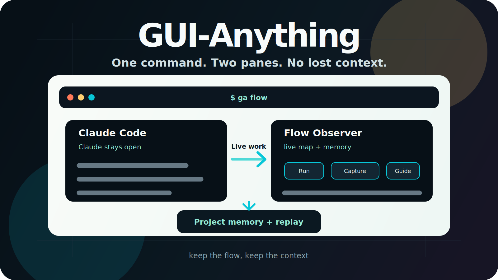
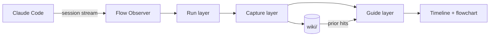

<p align="right">
  <a href="README.md">English</a> · <strong>简体中文</strong>
</p>

<p align="center">
  
</p>

<h1 align="center">GUI-Anything</h1>

<p align="center">
  <strong>长 Claude Code 会话的飞行记录器。</strong>
</p>

<p align="center">
  Claude 继续在左栏写代码。GUI-Anything 在右栏观察，<br>
  把长会话变成实时地图，并在需要时带回有用上下文。
</p>

<p align="center">
  <a href="#快速开始"><b>快速开始</b></a> ·
  <a href="#sidecar-视图"><b>Sidecar 视图</b></a> ·
  <a href="#记忆层"><b>记忆层</b></a> ·
  <a href="#工作原理"><b>架构</b></a> ·
  <a href="#参与贡献"><b>参与贡献</b></a>
</p>

<p align="center">
  <a href="https://opensource.org/licenses/MIT"></a>
  
  
  
</p>

<br>

> Vibe coding 很快，直到线索消失。GUI-Anything 补上旁路观察层：实时时间线、意图图、项目记忆，以及可信的回放 —— 同时不包裹也不驱动 Claude Code。

<table align="center">
<tr>
<td align="center" width="33%">
<strong>Run</strong><br><br>
Claude Code 保持原生左栏体验。右栏实时展示探索、工具、阶段和错误。
</td>
<td align="center" width="33%">
<strong>Capture</strong><br><br>
长滚动区会被整理成摘要、流程图线索和按意图聚合的上下文。
</td>
<td align="center" width="33%">
<strong>Guide</strong><br><br>
相关项目记忆会在当前探索仍在进行时出现。Resume 保持上下文连续。
</td>
</tr>
</table>

---

## 快速开始

**依赖：** [Claude Code CLI](https://docs.anthropic.com/en/docs/claude-code) · [Bun](https://bun.sh) · [Zellij](https://zellij.dev)

源码安装：

```bash
git clone https://github.com/YurunChen/GUI-Anything.git
cd GUI-Anything
./scripts/setup.sh
ga doctor
ga flow
```

常用命令：

| 命令 | 用途 |
|------|------|
| `ga doctor` | 检查依赖与环境 |
| `ga flow` | 启动 Claude Code + 观察器双栏 |
| `ga flow --continue` | 继续会话；仅为新探索补摘要 |
| `ga flow --resume <session-id>` | 回放已保存的 session 数据 |
| `ga flow --model sonnet "your task"` | 指定模型与初始 prompt 启动 |
| `./scripts/flow-run.sh --cleanup` | 清理过期的 flow runtime |

---

## Sidecar 视图

GUI-Anything 是 **sidecar**。Claude Code 原样运行，观察器把会话呈现为时间线、流程图、摘要和项目记忆。

| 左栏 | 右栏 |
|------|------|
| Claude Code 原样运行 | Flow Observer 实时观察会话 |
| 你保留正常终端工作流 | 时间线、阶段、工具、错误和摘要保持可见 |
| 没有 wrapper 接管 agent | 有用上下文保存在本地，之后可继续用 |
| 会话可以很长很乱 | 地图仍然保持可读 |

先聚焦**右栏**，再操作：

| 按键 | 动作 |
|------|------|
| `g` | 时间线 / 流程图 |
| `i` | 笔记侧栏 |
| `?` / `/` / `Ctrl-K` | 帮助 |
| `c` | Calm 模式 |
| `[` `]` | 上一 / 下一主题 |
| `k` | 标记错误记忆命中 |
| `h` | 导出并打开项目演进 HTML |
| `q` | 退出观察器 |

中文界面：`FLOW_LOCALE=zh-Hans`。

---

## 记忆层

大多数 coding agent 会生成。更少工具帮你记住刚发生过什么。GUI-Anything 保留同一工作的三种视图：

| 层 | 捕获什么 | 你拿回什么 |
|----|----------|------------|
| **Run** | 探索、工具调用、错误、阶段 | 不再只面对一长段终端滚动区，而是实时会话时间线 |
| **Capture** | 摘要、流程图线索、意图聚合 | 看到工作的形状，而不只是完整 transcript |
| **Guide** | 过往项目记忆和聚焦线索 | 当前回合仍在进行时，就能拿到过去 session 的上下文 |

项目记忆默认留在本地。相关轮次按 intent 聚合；策展在 pivot 或 idle sweep 时发生，不是每轮都写。

---

## 它为什么不一样

| 能力 | 设计选择 |
|------|----------|
| **原生 Claude 双栏** | 左边仍然是 Claude Code。GUI-Anything 观察，不接管。 |
| **实时流程图** | 探索轮次变成可读的意图图，并适配不同终端宽度。 |
| **Inline KNOWLEDGE 命中** | 过往本地记忆会在当前探索仍在运行时出现。 |
| **Intent 感知策展** | 同任务轮次进入同一组；pivot 或 idle sweep 后沉淀为持久上下文。 |
| **诚实 resume** | `--resume` 回放已保存的 session 数据，不会悄悄重建故事。 |
| **Continue 不漂移** | `--continue` 保留现有上下文，只为新增探索补摘要。 |
| **33 套终端主题** | 用 `[` 和 `]` 原地切换；Spectra 是动态展示主题。 |
| **可分享 HTML** | 导出项目演进页、单 session 下钻页或知识图谱。 |
| **Web Mirror** | 终端不是最佳展示方式时，可以在浏览器里看进度。 |
| **微信通知** | 离开电脑也能收到错误和里程碑。 |

---

## 演示素材

计划为本节录制的真实片段（见 [Roadmap](#roadmap)）：

| 文件 | 时长 | 故事 |
|------|------|------|
| `assets/demo/hero.mp4` / `hero.gif` | 12–18s | 启动 `ga flow`，观察时间线和流程图更新 |
| `assets/demo/knowledge.gif` | 8–12s | 过往记忆命中出现，再用 `k` 审计错误匹配 |
| `assets/demo/resume.gif` | 8–12s | `ga flow --resume <id>` 不重新摘要，直接回放 |

静态预览：[`assets/demo/readme-hero.svg`](assets/demo/readme-hero.svg)。

---

## 工作原理

```text
Run      session stream → explorations, tools, errors, phases
Capture  AI summaries, flowchart hints, intent buckets, memory curation
Guide    prior memory, flowchart, notes, hotkeys
```



更多细节：[数据流](docs/data-governance/data-flow.md) · [开发指南](docs/development.md) · [Agent 规则](AGENTS.md)

---

## 可选能力

<details>
<summary><strong>HTML 导出</strong> — 项目演进、镜像、知识图谱</summary>

```bash
# 项目演进，默认覆盖当前 workspace 的所有 sessions。
ga export -o evolution.html

# 在 ga flow 中，按 h 可导出并打开项目演进页面。

# 只查看单个 session。
ga export --scope session --session-id <id> -o evo.html

# 跳过 AI era synthesis，使用确定性规则分组。
ga export --no-ai --theme catppuccin -o evo.html

# 浏览器实时视图。
cd scheme
FLOW_PROJECT_DIR=/path/to/repo FLOW_SESSION_ID=<uuid> \
  bun run src/main.ts --web-mirror --port 3001

# 从本地 wiki 生成力导向图。
bun run src/main.ts --knowledge-graph -o graph.html
```

见 [docs/IDEAS_HTML_INTEGRATION.md](docs/IDEAS_HTML_INTEGRATION.md)。

</details>

<details>
<summary><strong>推送通知</strong> — 微信</summary>

```bash
ga notify setup
ga flow
```

见 [docs/NOTIFICATION.md](docs/NOTIFICATION.md) 与 [docs/NOTIFICATION_WECHAT.md](docs/NOTIFICATION_WECHAT.md)。

</details>

<details>
<summary><strong>llm-wiki</strong> — Agent 化知识入库</summary>

Wiki 策展使用 [skills/llm-wiki](skills/llm-wiki/) 里的 `/llm-wiki` skill。

```bash
./scripts/setup.sh
./scripts/wiki/wiki-maintain.sh
```

见 [scripts/wiki/README.md](scripts/wiki/README.md)。

</details>

---

## 项目状态

GUI-Anything 还早，但已经可用。当前支持路径是 Claude Code sidecar。

| 区域 | 状态 |
|------|------|
| `ga flow` 双栏启动器 | 支持 |
| Claude Code session observer | 支持 |
| 本地记忆检索与策展 | 支持 |
| 严格 resume / continue replay | 支持 |
| HTML export / Web Mirror | 实验性 |
| 其他 Agent 后端 | 暂未支持 |

---

## Roadmap

- 为 README 录制真实 `ga flow` 演示视频
- 打磨 Web Mirror 的手机和平板监控体验
- 支持 Claude Code 之外的更多 session 格式
- 扩展 wiki 维护报告和错误命中审计流程
- 打包更多主题和终端 layout

---

## 参与贡献

欢迎 Issue 和 PR。先看这些：

| 文档 | 面向 |
|------|------|
| [CONTRIBUTING.md](CONTRIBUTING.md) | 本地搭建、验证、PR checklist |
| [docs/development.md](docs/development.md) | 架构与扩展指南 |
| [AGENTS.md](AGENTS.md) | Coding Agent 原则与红线 |
| [docs/data-governance/data-flow.md](docs/data-governance/data-flow.md) | Wiki 与 session 数据流 |
| [docs/THEMES.md](docs/THEMES.md) | 主题目录 |

最低验证：

```bash
cd scheme && bun test && bunx tsc --noEmit
ga doctor
```

请不要提交 `wiki/`、`.flow-runtime/`、本地 log 或密钥。

---

## 常见问题

<details>
<summary><strong>GUI-Anything 会替代或控制 Claude Code 吗？</strong></summary>

不会。它是 sidecar：观察 session stream，渲染观察器，并保存本地上下文。Claude Code 原样运行。

</details>

<details>
<summary><strong>每个 exploration 都会写 wiki 吗？</strong></summary>

不会。相关轮次按 intent 积累。Wiki 策展在 intent pivot 或 idle sweep 时触发，不是每轮都写。

</details>

<details>
<summary><strong>KNOWLEDGE 和 wiki saved 有什么区别？</strong></summary>

`KNOWLEDGE` 是对已有本地 wiki 的 prior 检索。`wiki saved` 表示本次 session 策展并写入新内容。二者独立。

</details>

<details>
<summary><strong>能和 Cursor 或其他 Agent 一起用吗？</strong></summary>

暂时不能。Observer 模式本身与 Agent 无关，但本仓库目前支持 Claude Code sessions。

</details>

<details>
<summary><strong>数据存在哪里？</strong></summary>

默认在 `<repo>/wiki/`，该目录 gitignored。可用 `FLOW_WIKI_DIR` 覆盖。

</details>

---

## 许可证

MIT。Claude Code 与第三方工具适用各自条款。

<p align="center">
  <strong>别再丢线索了。</strong><br>
  给长 agent 会话一张地图、一份记忆和一个回放按钮。
</p>
