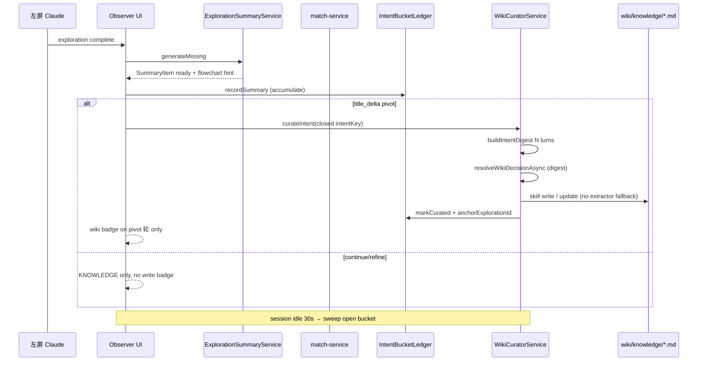
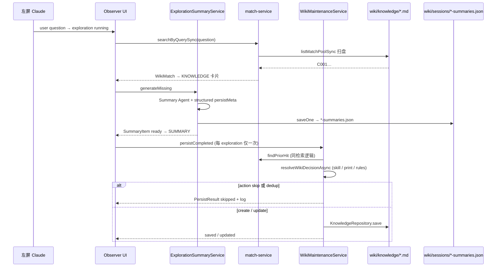

# 数据流转链路（新格式）

## 完整数据流

```
┌─────────────────────────────────────────────────────────────────────────────┐
│                              应用层 (app/)                                    │
├─────────────────────────────────────────────────────────────────────────────┤
│                                                                             │
│  useExplorationSummaries.ts                                                 │
│  ├── 调用: DefaultExplorationSummaryService                                 │
│  │   ├── hydrateFromCache() → wiki/sessions/{session}-summaries.json       │
│  │   └── hydrateFromWiki() → KnowledgeRepository.listAll()                 │
│  │                                                          ↓              │
│  └── 调用: generateMissing()（仅 allowRegen=true）→ saveSummary()          │
│                                    ↓                                        │
│                             wiki/sessions/{session}-summaries.json         │
│                                                                             │
│  useWikiMatches.ts → match-service（用户问题出现即检索，running 起展示 KNOWLEDGE）│
│  useWikiCurator.ts（别名 useWikiPersistence）                                  │
│  └── pivot 关闭 intent / session idle sweep → WikiCuratorService.curateIntent│
│      同 intent 内只积累 intent-buckets；卡片 meta：anchor 轮 wiki saved/skipped │
│      审计：`k` 快捷键 → audit/*.md（Phase 2 用户主动）                        │
│                          ↓                                                  │
└─────────────────────────────────────────────────────────────────────────────┘
                                    ↓
┌─────────────────────────────────────────────────────────────────────────────┐
│                             服务层 (services/)                                │
├─────────────────────────────────────────────────────────────────────────────┤
│                                                                             │
│  ai/exploration-summary-service.ts                                          │
│  └── 使用: KnowledgeRepository (新)                                         │
│                                                                             │
│  wiki/wiki-curator-service.ts                                               │
│  ├── Intent digest → Wiki Agent (skill-only write contexts/)               │
│  └── post-process: index / log / progress                                   │
│                                                                             │
│  wiki/wiki-maintenance-service.ts（legacy: FLOW_WIKI_LEGACY_PER_TURN=1）    │
│                                                                             │
│  wiki/audit-service.ts → knowledge/audit/*.md（用户 `k` 快捷键）            │
│                                                                             │
│  ai/summary-cache.ts                                                        │
│  └── 重导出 → data/wiki/summary-repository.ts                               │
│                                                                             │
│  session/graph-cache-service.ts                                             │
│  └── session-flow-repository.ts → wiki/sessions/{sessionId}.json           │
│                                                                             │
│  session/session-binding-policy.ts                                          │
│  └── resume 可见性 / summary allowRegen（launcher 设 FLOW_RESUME_MODE）       │
│  session/session-presentation-policy.ts                                     │
│  └── live vs replay、stale 缓存、摘录兜底（见 display-policy.md）              │
│                                                                             │
└─────────────────────────────────────────────────────────────────────────────┘
                                    ↓
┌─────────────────────────────────────────────────────────────────────────────┐
│                              数据层 (data/)                                   │
├─────────────────────────────────────────────────────────────────────────────┤
│                                                                             │
│  wiki/knowledge-repository.ts                                               │
│  ├── 读取: knowledge/{contexts,entities,summaries}/**/*.md                  │
│  └── 保存: 扁平或嵌套路径；update 保留已有 relativePath                    │
│                                                                             │
│  wiki/evidence-repository.ts                                                │
│  ├── 读取: sessions/{sessionId}-evidence.json (聚合)                         │
│  └── 保存: sessions/{sessionId}-evidence.json (聚合)                       │
│                                                                             │
│  wiki/summary-repository.ts → sessions/{sessionId}-summaries.json           │
│  wiki/note-repository.ts → notes/{YYYY-MM-DD}.md                            │
│                                                                             │
└─────────────────────────────────────────────────────────────────────────────┘
```

## 目录结构（三链）

```
wiki/
├── knowledge/                      ← Wiki 知识（长期 markdown）
│   ├── SCHEMA.md, index.md, log/, audit/
│   ├── contexts/                   ← 主链；可递归 {topic}/；error/snippet/decision 归一化为 context+facet
│   ├── entities/                   ← N-prefix 实体页
│   ├── summaries/                  ← agent-only；UI match 排除
│   └── outputs/progress/index.html ← 服务层生成
├── sessions/                       ← Session 派生 + 证据（json）
│   ├── {sessionId}-summaries.json  ← AI 摘要 + flowchart hints
│   ├── {sessionId}.json            ← Flow 图 + flowchartHints（真相源）
│   ├── {sessionId}-graph-patches.json
│   └── {sessionId}-evidence.json   ← exploration 证据聚合
└── notes/                          ← 用户笔记
    └── 2025-04-27.md
```

路径常量（唯一来源）：`scheme/src/data/wiki/wiki-data-layout.ts`。

**Wiki 根目录（易混）**：`resolveWikiRoot()` → `FLOW_WIKI_DIR` ?? `FLOW_ROOT_DIR/wiki` ?? `FLOW_PROJECT_DIR/wiki` ?? `cwd/wiki`。`flow-run.sh` 会设 `FLOW_ROOT_DIR` 为仓库根，故长期知识在 **`<repo>/wiki/knowledge/`**；`scheme/wiki/` 仅可能在未设 `FLOW_ROOT` 时出现（如本地直接 `cd scheme && bun run`，且通常只有 `sessions/*-intent.json` 等残留）。

## Wiki：检索 vs 落盘（两条链）

| 链 | 时机 | 读/写 | UI |
|----|------|-------|-----|
| **Prior 检索** | 用户问题写入 `exploration.question` 后（`running` 即可），每帧同步 | 只读 `listMatchPoolSync()`（`contexts/` + `entities/`，**不含** `summaries/`） | KNOWLEDGE 卡片（与 SUMMARY 无关） |
| **Post-summary 落盘** | **pivot 关闭 intent** 或 session idle sweep | Intent digest → **Wiki Curator**（skill-only 写 `contexts/`） | 卡片 meta：**仅 anchor 轮** `wiki saved/updated/skipped` |

二者独立：**有 prior hit** 只影响 KNOWLEDGE 卡片；同 intent 内 continue/refine **只积累** `*-summaries.json` / `{sessionId}-intent-buckets.json`，**不**每轮写 `contexts/`。策展输入为同 intent 多轮 digest；skill 失败 → `skipped: skill_failed`，**禁止** auto-extractor 回落 create。

**Prior 检索只执行一次**：`useWikiMatches` 在问题首次可检索时锁定命中结果；策展完成**不会**刷新 KNOWLEDGE（下一轮新问题才会再检）。

### Intent 策展时间序



### 落盘决策树（`WikiCuratorService.curateIntent`）

1. 门禁：`shouldSkipIntentCurate` — 空 bucket / 全 low_value / 无 solution_detail 且无工具轮 → skip
2. `buildIntentDigest` — 多轮 `*-summaries.json` + evidence sidecar
3. `findPriorHitForDigest` + `resolveWikiDecisionAsync`（digest 模式 prompt）
4. skill 失败或无 prior 且 rules 回落 → `skipped: skill_failed` / `skill_only_no_prior`（**不** `extractWikiEntry` → create）

## Wiki：治理链（Phase 2，手动 CLI）

与 Phase 1 ingest 同属 `/llm-wiki` skill；Phase 2 **不**在 Observer 内自动调度。

| 步骤 | 动作 |
|------|------|
| Flow pivot/sweep | Phase 1 ingest（自动）→ 有维护项则 Phase 2（同 `/llm-wiki` skill） |
| 用户 `k` | KNOWLEDGE prior 有误 → `knowledge/audit/*.md`（open） |
| `wiki-maintain.sh --list-audits` | 列出 open（severity、target_id）/ resolved |
| `wiki-maintain.sh --dry-run` | 报告：open audits + lint + intent 桶统计 |
| `wiki-maintain.sh` | `/llm-wiki` Phase 2 → 修条目 / 迁路径 / `audits_resolved` |
| 服务层 | `rebuildKnowledgeIndex`、log、progress（与 ingest 相同） |

Skill：`skills/llm-wiki/`（Phase 1 + Phase 2）。代码：`wiki-maintenance-report.ts`、`wiki-maintain-agent/`、`wiki-maintain-service.ts`。

Legacy：`FLOW_WIKI_LEGACY_PER_TURN=1` 恢复每 exploration `persistCompleted`（开发对比用）。

### 单轮时间序（legacy，已默认关闭）



### 落盘决策树（`maintainExploration`）

1. 门禁：`resolveWikiPersistPhase` 要求 exploration `complete` + AI summary ready；`persistence-service` 再调本服务
2. 无摘要文本 → `skipped: missing_summary`
3. `isLowValue`（短问候等）→ `skipped: low_value`
4. `findPriorHit` + `resolveWikiDecisionAsync`（Wiki Agent，不看 Summary `should_persist`）：
   - **skill**（`/llm-wiki`，`acceptEdits`）：Agent 可先写盘，再交 manifest；服务层 `resolveAgentWriteProof` 校验
   - **claude --print**：JSON 决策
   - **rules**：有 prior → 默认 `update`；无 prior → `extractWikiEntry` → `create` 或 `skip`
5. `decision.action === 'skip'` → `skipped`（reason 来自 Agent，如 `skip` / 无增量）
6. **create 路径** → `deduplicateKnowledge`：
   - 同 `sessionId` + `explorationId` 已有条目 → `already_exists_same_source`
   - `request` 与库内相似（≥0.85）→ `similar_request_exists`（仍会显示 prior hit 的 C001）
7. **update 路径** → `KnowledgeRepository.save(overwrite)` → `updated`（目标文件不存在则回落 `create`）

### 与「删了 wiki 仍命中」相关的机制

- **KNOWLEDGE 只认磁盘上的 `knowledge/{contexts,entities}/**/*.md`**，不认 `*-summaries.json`（摘要缓存删了不影响 prior hit）。
- **删 markdown 后**：下一轮检索应无 hit；若仍有 hit，说明当时磁盘上仍有该文件（常见：本轮/上一轮 **落盘或 Agent skill 又写回** C001）。
- **Observer 进程内**：intent 策展对同一 bucket **只 curate 一次**（`curatedAt` 后不再触发）；删 `knowledge/*.md` **不会**自动重跑 Agent。Legacy per-turn：`useWikiPersistence` + `resolveWikiPersistPhase` 仍可对同一 `exploration.id` 只跑一次。

### Observer UI：检索 vs 落盘展示

| 区域 | 内容 |
|------|------|
| **探索卡片** | 用户问题 · 工具 meta · **KNOWLEDGE**（规则检索，`running` 起即可展示）· SUMMARY |
| **顶栏 `ObserverStatusBar`** | 第 1 行会话 meta；第 2 行 Intent（仅当前 `node_title`），无 Running tools / Summarizing 等活动行 |
| **探索卡片 meta** | `done · N tools`；**仅 pivot/sweep anchor 轮** 追加 `wiki updated · C001 · N turns` |

展示：读链 `wiki-turn-chrome.ts`（`resolveWikiTurnUi`）；写链 `wiki-write-chrome.ts`（`resolveWikiWriteChrome`）；积累/策展 `useWikiCurator` + `wiki-persist-policy.ts`。

- **frontmatter 遗留**：如 `source: exploration/exp_1`（非 `session_id` / `exploration_id` 块）时，解析得到 `sessionId=""`，`hydrateFromWiki` / `findBySource` 可能对不上，但 **按 request 相似度的检索与 dedup 仍可能命中 C001**。

### 三份存储分工

| 路径 | 内容 | 删了的影响 |
|------|------|------------|
| `wiki/knowledge/**/*.md` | 长期知识 | KNOWLEDGE / prior hit / 落盘目标 |
| `wiki/sessions/{id}-intent-buckets.json` | Intent 多轮积累 + 策展状态 | pivot/sweep 触发写盘；anchor badge 来源 |
| `wiki/sessions/{id}-summaries.json` | AI 摘要 + flowchart + persistMeta | SUMMARY 可来自缓存重显，**不**直接写 contexts |
| `wiki/sessions/{id}-evidence.json` | 证据聚合 | 不影响 KNOWLEDGE 卡片 |

摘要契约（跨层唯一形状）：`scheme/src/data/protocol/summary-contract.ts` — `SummaryItem` 从 cache/AI → 应用展示 → wiki 落盘，禁止拆成 `summaries` + `persistMeta` 两条并行 map 再拼装。

`knowledge-base/` 等旧布局：`scripts/wiki/migrate-wiki-layout.sh`（仅搬 contexts/entities/summaries；errors/snippets/decisions 直接删除）。工程类顶层目录 `errors/snippets/decisions/` 与 `E###`/`S###`/`D###` 条目在 `ensureKnowledgeMetaLayout` 时自动删除，或 `./scripts/wiki/purge-legacy-knowledge.sh`。

## 更新后的导入链

```typescript
// 应用层
import { DefaultExplorationSummaryService } from 'services/ai/exploration-summary-service';
import { DefaultWikiPersistenceService } from 'services/wiki/persistence-service';

// 服务层
import { KnowledgeRepository } from 'data/wiki/knowledge-repository';
import { EvidenceRepository } from 'data/wiki/evidence-repository';

// 不再存在
// import { FileWikiRepository } from 'data/wiki/repository'; ❌ 已删除
```

## 重启验证清单

1. [ ] 若 wiki 仍在旧目录，先运行 `./scripts/wiki/migrate-wiki-layout.sh`
2. [ ] 重启 observer（若曾误报 `skipped · already_exists`，需重启后 `getExistingIds()` 才会扫到 `knowledge/{type}/` 下已有条目）
3. [ ] 执行一个 exploration
4. [ ] 检查 `wiki/knowledge/{type}/` 有新格式文件（ID 如 `C002` 递增，不重复 `C001`）
5. [ ] 检查 `wiki/sessions/{session}-evidence.json` 存在
6. [ ] 检查 `wiki/sessions/{session}-summaries.json` 存在
